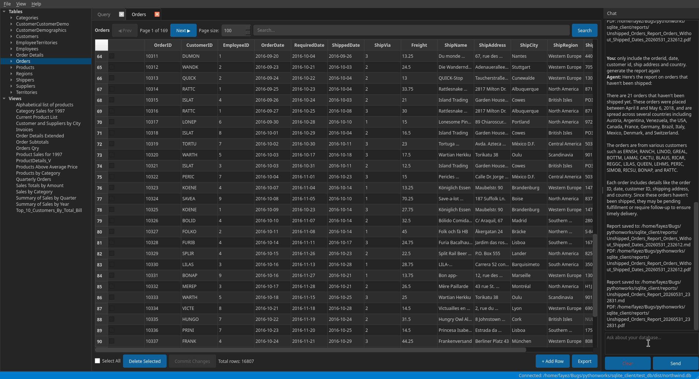

# SQLite Client

A PyQt6-based desktop SQLite database client. Open local `.db` files or databases inside Docker volumes, browse tables, run SQL queries, visualize schemas as ER diagrams, and chat with an AI assistant about your data — all without freezing the UI.



## Features

- **Database connection management** — Open existing `.db`/`.sqlite` files, create new databases, or browse and open databases from **Docker volumes** via a tree-view dialog with file picker, recent files list, or volume browser
- **Schema browser** — Tree view of tables (with column names, types, primary keys, nullable, default values) and views, with context menu for ER diagram
- **ER diagram viewer** — Auto-layout entity-relationship diagrams with connected-component clustering, bezier FK→PK edges, exported as high-resolution PNG (3x oversampled, 150 DPI)
- **SQL query editor** — Multi-tab editor with SQL syntax highlighting and `Ctrl+Enter` execution
- **Query results** — Tabular results display with row count and execution time, exportable
- **Data browser** — Paginated table browsing with adjustable page size (10–1000), search/filter across all columns, deferred inline cell editing via **Commit Changes** button, **add row** (with type-appropriate defaults for NOT NULL columns), batch delete with confirmation, double-click editing starts with current cell value
- **Export** — Export tables or query results to CSV, JSON, or SQL INSERT statements
- **Dark/Light mode** — Toggle via View menu, persisted across sessions
- **Font selection** — Choose font family and size via **View > Font...** dialog, persisted across sessions
- **App-state persistence** — Last-opened database, recent files list, theme, and font preference saved via `QSettings`
- **Auto-refresh** — Local database files are watched via `QFileSystemWatcher`; Docker volume databases are polled every 30s for external changes and auto-refreshed
- **Chat assistant** — Collapsible dock panel on the right side for natural-language queries about your database. Persists per-database chat history across sessions. Supports professional report generation (markdown + PDF) with a ``save`` / ``report`` / ``export`` command. **Clear history** button with confirmation dialog. Agent runs on its own background thread. Uses LangChain with HuggingFace models.
- **Non-blocking operations** — All database reads, writes, and chat-agent calls execute on dedicated worker threads so the GUI never freezes
- **Keyboard shortcuts** — `Ctrl+O` (open database), `Ctrl+W` (close database), `Ctrl+Q` (quit), `Ctrl+Enter` (execute query)

## Requirements

- Python 3.13+
- PyQt6 >= 6.5

## Tech Stack

| Layer | Technology |
|-------|-----------|
| **Language** | Python 3.13+ |
| **GUI Framework** | PyQt6 (Qt 6) |
| **Database** | SQLite3 (via `sqlite3` module, WAL mode, `check_same_thread=False`) |
| **ORM / Query** | Raw SQL with parameterised queries, `QueryExecutor` wrapper |
| **Charts / PDF** | WeasyPrint (markdown → HTML+CSS → PDF pipeline) |
| **AI / LLM** | LangChain, HuggingFace Inference API (Qwen/Qwen3.5-4B default) |
| **Async Model** | `QThread` + `QObject` worker pattern (cross-thread signals) |
| **Testing** | pytest, pytest-qt |
| **Packaging** | `pyproject.toml`, `uv` package manager |
| **UI Patterns** | `QAbstractTableModel` (Model/View), `QDockWidget`, `QSplitter`, `QTabWidget` |
| **Persistence** | SQLite (chat history), `QSettings` (app preferences) |

## Installation

```bash
# Clone the repository
git clone <repo-url>
cd sqlite_client

# Create and activate virtual environment with uv
uv venv
source .venv/bin/activate

# Install dependencies
uv sync --extra dev
```

## Usage

```bash
# Launch the application
uv run python main.py
```

### Running Tests

```bash
uv run pytest -v
```

## Project Structure

```
sqlite_client/
├── main.py                  # Entry point — parses CLI args, creates QApplication
├── app.py                   # QApplication factory (no hardcoded theme)
├── pyproject.toml           # Project metadata, deps, tool config
├── README.md
├── core/
│   ├── __init__.py
│   ├── database.py          # DatabaseConnection — sqlite3 wrapper, schema introspection, WAL mode
│   ├── docker_volume.py     # Docker CLI wrapper — list volumes, browse trees, copy files in/out, file stat polling
│   ├── er_diagram.py        # ER diagram engine — Pillow rendering, 3x oversampled, connected-component layout
│   ├── query_executor.py    # QueryExecutor — SQL execution with timing, error handling, is_select detection
│   ├── worker.py            # DatabaseWorker — QObject on a QThread for non-blocking DB operations
│   └── export.py            # Export to CSV, JSON, and SQL INSERT format
├── ui/
│   ├── __init__.py
│   ├── main_window.py       # MainWindow — QMainWindow, splitter layout, worker thread lifecycle, menu, Docker poll timer, QFileSystemWatcher
│   ├── schema_browser.py    # SchemaBrowser — QTreeWidget of tables, views, columns, ER diagram context menu
│   ├── query_editor.py      # QueryEditorWidget — multi-tab SQL editor with per-tab results
│   ├── results_view.py      # ResultsView — QTableView for query results, info bar (rows + duration)
│   ├── data_browser.py      # DataBrowser — paginated table view, deferred edits, Commit Changes button, refresh()
│   ├── connection_dialog.py # ConnectionDialog — open / create / Docker volume database dialog
│   ├── docker_volume_dialog.py # DockerVolumeDialog — volume list + directory tree with QTreeView
│   ├── er_dialog.py         # ErDialog — scrollable ER diagram display with export button
│   ├── export_dialog.py     # ExportDialog — format picker and save dialog
│   └── syntax_highlight.py  # SqlHighlighter — QSyntaxHighlighter for SQL keywords, strings, numbers
├── resources/
│   ├── __init__.py
│   └── style.py             # LIGHT_THEME, DARK_THEME, and THEMES dict with comprehensive QSS (including QTreeView)
├── chat/
│   ├── __init__.py
│   ├── agent.py             # Chat agents (RouterChatAgent, SqlAgent, GeneralChatAgent, etc.)
│   ├── chat_panel.py        # ChatPanel — collapsible chat widget
│   ├── chat_store.py        # ChatStore — per-database conversation persistence
│   ├── report_tool.py       # Professional report generation (markdown + PDF via WeasyPrint)
│   └── worker.py            # ChatWorker — QObject on background QThread
└── tests/
    ├── __init__.py
    ├── chat/
    │   ├── __init__.py
    │   ├── test_agent.py
    │   ├── test_chat_panel.py
    │   ├── test_chat_store.py
    │   ├── test_report_tool.py
    │   └── test_worker.py
    ├── core/
    │   ├── __init__.py
    │   ├── test_database.py       # 14 tests
    │   ├── test_docker_volume.py  # 28 tests (mocked subprocess)
    │   ├── test_er_diagram.py     # 10 tests
    │   ├── test_query_executor.py # 16 tests
    │   └── test_export.py         # 9 tests
    └── ui/
        ├── __init__.py
        ├── test_main_window.py        # 11 tests
        ├── test_schema_browser.py     # 6 tests
        ├── test_query_editor.py       # 9 tests
        ├── test_results_view.py       # 10 tests
        ├── test_data_browser.py       # 26 tests
        ├── test_connection_dialog.py  # 4 tests
        └── test_syntax_highlight.py   # 5 tests
```

## Architecture

```
┌──────────────────────────────────────────────────────────────────────────┐
│                       MainWindow (QMainWindow)                          │
│  ┌──────────────┬────────────────────────────────┬──────────────────┐   │
│  │              │                                │                  │   │
│  │  Schema      │     QTabWidget (right tabs)    │  Chat Dock       │   │
│  │  Browser     │  ┌───────────────────────┐    │  (QDockWidget)   │   │
│  │  (QTree-     │  │  QueryEditorWidget    │    │  ┌────────────┐  │   │
│  │   Widget)    │  │  ┌────┐ ┌────┐ ┌────┐│    │  │ You: ...   │  │   │
│  │              │  │  │SQL │ │SQL │ │SQL ││    │  │ Agent: ... │  │   │
│  │  emits       │  │  │ #1 │ │ #2 │ │ #3 ││    │  │            │  │   │
│  │  *_selected  │  │  └────┘ └────┘ └────┘│    │  ├────────────┤  │   │
│  │              │  ├───────────────────────┤    │  │ [Input]    │  │   │
│  │              │  │  DataBrowser (per     │    │  │ [Send]     │  │   │
│  │              │  │  table)               │    │  └────────────┘  │   │
│  │              │  │  ┌─────────────────┐  │    │                  │   │
│  │              │  │  │ QTableView      │  │    │  Collapsible    │   │
│  │              │  │  │ [✔][id][name]   │  │    │  via X button   │   │
│  │              │  │  │ [☑][ 1][Alice]  │  │    │  or View > Chat │   │
│  │              │  │  └─────────────────┘  │    │                  │   │
│  │              │  └───────────────────────┘    │                  │   │
│  └──────────────┴────────────────────────────────┴──────────────────┘   │
│                                                                          │
│  ┌──────────────────────────────────────────────────────────────────┐    │
│  │  Status Bar:  Connected: /path/to/database.db                    │    │
│  └──────────────────────────────────────────────────────────────────┘    │
└──────────────────────────────────────────────────────────────────────────┘
                         │
                         │ Signals (cross-thread via queued connections)
                         ▼
┌──────────────────────────────────────────────────────────────────────────┐
│  ┌─────────────────────────────────────────┐  ┌──────────────────────┐  │
│  │         Worker Thread #1                 │  │  Worker Thread #2   │  │
│  │  ┌─────────────────────────────────┐    │  │  ┌────────────────┐  │  │
│  │  │     DatabaseWorker (QObject)    │    │  │  │ ChatWorker     │  │  │
│  │  │  ┌──────────────────┐           │    │  │  │ (QObject)      │  │  │
│  │  │  │ DatabaseConnection│           │    │  │  │                │  │  │
│  │  │  │ (sqlite3, WAL)   │           │    │  │  │ Slots:         │  │  │
│  │  │  └──────────────────┘           │    │  │  │ - send_message │  │  │
│  │  │  ┌──────────────────┐           │    │  │  │                │  │  │
│  │  │  │ QueryExecutor    │           │    │  │  │ Signals:       │  │  │
│  │  │  └──────────────────┘           │    │  │  │ - response_    │  │  │
│  │  │                                │    │  │  │   received(msg, │  │  │
│  │  │  Slots:                        │    │  │  │   reply)        │  │  │
│  │  │  - request_query(sql)          │    │  │  └────────────────┘  │  │
│  │  │  - request_data_page(...)      │    │  └──────────────────────┘  │  │
│  │  │  - request_commit(...)         │    │                            │  │
│  │  │  - request_add_row(...)        │    │                            │  │
│  │  │  - request_delete_rows(...)    │    │                            │  │
│  │  │                                │    │                            │  │
│  │  │  Signals:                      │    │                            │  │
│  │  │  - query_finished(QueryResult) │    │                            │  │
│  │  │  - data_page_finished(...)     │    │                            │  │
│  │  │  - edits_committed(table)      │    │                            │  │
│  │  │  - row_added(table)            │    │                            │  │
│  │  │  - rows_deleted(table)         │    │                            │  │
│  │  │  - error(msg)                  │    │                            │  │
│  │  └─────────────────────────────────┘    │                            │
│  └─────────────────────────────────────────┘  └──────────────────────┘  │
└──────────────────────────────────────────────────────────────────────────┘
```

### Data Flow

#### Query Execution
```
User types SQL → Ctrl+Enter
  └─► QueryEditor emits execute_query_requested(sql)
       └─► MainWindow relays to DatabaseWorker.request_query(sql) [queued]
            └─► Worker thread executes via QueryExecutor
                 └─► Worker emits query_finished(QueryResult) [queued]
                      └─► QueryEditor receives → populates ResultsView
```

#### Data Browser Page Load
```
User opens table / navigates / searches
  └─► DataBrowser emits load_page_requested(table, page, size, search)
       └─► Worker.request_data_page(...)
            └─► Worker thread: COUNT(*) + SELECT with LIMIT/OFFSET
                 └─► Worker emits data_page_finished(table, cols, rows, total)
                      └─► DataBrowser._on_data_page_loaded → updates DataTableModel
```

#### Chat Message Flow
```
User types message → presses Enter / clicks Send
  └─► ChatPanel emits message_sent(text)
       └─► MainWindow relays to ChatWorker.send_message(text) [queued]
            └─► Chat Worker thread: RouterChatAgent.answer(text)
                 ├─► RouterAgent classifies message as "chat" or "sql"
                 ├─► Past conversation history is prepended as LangChain messages
                 ├─► GeneralChatAgent or SqlAgent answers
                 │    └─► SqlAgent (if SQL needed):
                 │         Stage 1 — LLM writes SQL → extract ```sql block
                 │         Stage 2 — Execute SQL → LLM answers in plain language
                 │         Stage 3 — If "save"/"report"/"export" intent:
                 │           ├─► New SQL? → LLM generates professional markdown report
                 │           │    (title, intro, results table, findings, conclusion)
                 │           └─► Follow-up "save" message without SQL?
                 │                → scans history for last query → re-executes → report
                 │           ├─► Saved as: reports/<Title>_<timestamp>.md
                 │           └─► Saved as: reports/<Title>_<timestamp>.pdf
                 └─► Worker emits response_received(user_msg, reply) [queued]
                      └─► ChatPanel.append_reply → shown in history

Clear history:
  └─► User clicks Clear (red button below input) → confirmation dialog
       └─► ChatPanel emits clear_requested
            └─► MainWindow relays to ChatWorker.clear_history() [queued]
                 └─► RouterChatAgent.clear_history() → ChatStore.clear_conversation()
                      └─► ChatPanel history cleared

Database open / close / startup:
  └─► MainWindow emits _chat_set_db(path) → ChatWorker.set_database_path(path)
       └─► RouterChatAgent switches conversation via get_or_create_conversation(path)
            └─► ChatWorker emits history_loaded(messages) → ChatPanel loads history
```

#### Inline Edit Flow
```
User edits a cell
  └─► DataTableModel emits data_changed(row, col)
       └─► DataBrowser.record_edit → stores (pk, col) → new_value in _pending_edits
            └─► "Commit Changes" button becomes enabled

User clicks "Commit Changes"
  └─► DataBrowser emits commit_requested(table, columns, pending_edits)
       └─► Worker.request_commit(table, columns, pending)
            └─► Worker thread: UPDATE each edit + COMMIT
                 └─► Worker emits edits_committed(table_name)
                      └─► DataBrowser._on_action_done → _request_page() → reloads data
                           └─► _on_data_page_loaded → clears _pending_edits, disables Commit button
```

### Key Design Decisions

- **sqlite3 + QThread** — Uses the `sqlite3` module directly (not `QSqlDatabase`) for full control over PRAGMAs, parameterised queries, and `check_same_thread=False` for cross-thread access.
- **`check_same_thread=False`** — The `DatabaseConnection` opens SQLite with `check_same_thread=False` so the connection can be created on any thread and used from the worker thread.
- **Model/View pattern** — `QAbstractTableModel` subclasses (`DataTableModel`, `ResultTableModel`) separate data from presentation widgets.
- **Parameterised queries** — All user-influenced SQL uses `?` placeholders to prevent SQL injection.
- **PRAGMA quoting** — PRAGMA statements use string formatting with double-quoting (`_quote()`) since SQLite does not support `?` placeholders in PRAGMAs.
- **Deferred inline edits** — Cell edits are collected in `_pending_edits` and batch-committed in a single transaction when the user clicks **Commit Changes**. Unsaved-change prompts on navigation.
- **Async worker** — All heavy DB operations run on a `DatabaseWorker` on a dedicated `QThread`. The worker owns its own `DatabaseConnection` to the same file. Schema/introspection queries remain synchronous on the main-thread connection.
- **State persistence** — `QSettings` persists dark mode preference, recent files list, and last-opened database path.
- **Feature branch workflow** — All changes go on feature branches, then fast-forward merged into `main`.
- **Per-database chat persistence** — Each conversation is linked to a database by its resolved absolute path (so ``./foo.db`` and ``/abs/foo.db`` share the same history). Reopening a database resumes its previous conversation. A separate "General Chat" conversation exists when no database is open. History survives app restarts.
- **Professional report generation** — When the user asks to ``save`` / ``report`` / ``export``, the ``SqlAgent`` enters a Stage 3 LLM call that generates a full professional markdown report with title, introduction, results table, key findings, and conclusion. The report is saved as both ``.md`` and ``.pdf`` (via WeasyPrint with professional CSS styling). Files go to ``reports/<Title>_<timestamp>.md`` / ``.pdf``. Follow-up "save" messages (without a new SQL query) automatically reuse the last query from conversation history.
- **Non-blocking chat** — The `ChatWorker` runs on its own `QThread` (separate from the database worker), so agent calls never block the UI or database operations.
- **Collapsible chat panel** — Uses `QDockWidget` on the right side of `MainWindow`. The user can close it (via X or **View > Chat** toggle) without losing state.
- **Clear history** — A red **Clear** button below the input box triggers a confirmation dialog before deleting the current conversation from the database.
- **Docker volume browser** — Docker volumes are not directly accessible on disk (they live in `/var/lib/docker/volumes/` owned by root, or inside a VM on Docker Desktop). The app uses `docker run --rm alpine:latest` with the volume mounted to traverse directories (`find`) and copy files (`cp`). The file is copied to `/tmp/sqlite_client_docker/<volume>/<safe_name>`, re-created with `shutil.copyfile` + `os.replace` to fix root ownership, then opened as a normal local database.
- **Docker volume sync-back** — On close, the user is prompted to save changes back to the volume. The local file is checkpointed (`PRAGMA wal_checkpoint(TRUNCATE)`) before copying into the volume to ensure WAL data is included.
- **Docker volume polling** — A 30-second `QTimer` polls the remote file via `wc -c` + `date -r` inside an Alpine container. When size or mtime changes, the file is re-copied and the database connection is re-established transparently.
- **ER diagrams** — Rendered entirely with Pillow (no system graphviz dependency). Tables are laid out using connected-component BFS clustering (unrelated table groups are visually separated). FK→PK edges use bezier curves. Rendered at 3x resolution then downscaled with LANCZOS for crisp text at 150 DPI.
- **Auto-refresh** — `QFileSystemWatcher` watches the `.db` (and `.db-wal` if present) for local files. A 500ms debounce timer prevents rapid refreshes from multiple file-change events. Refreshes schema browser and all open data browser tabs.
- **`_default_for_col`** — When adding a row, the `DatabaseWorker` provides type-appropriate defaults for NOT NULL columns without a schema DEFAULT (0 for INTEGER, 0.0 for REAL, "" for TEXT, `b""` for BLOB). Columns with a DEFAULT are omitted from the INSERT so SQLite applies them.

## Development

```bash
# Install with development dependencies
uv sync --extra dev

# Run all tests
uv run pytest

# Run specific test file
uv run pytest tests/core/test_database.py -v

# Run with coverage
uv run pytest --cov=core --cov=ui
```
